# Maxivz's Interactive Tools for Blender

This is a free collection of intuitive, context sensitive tools to improve productivity that I did to improve my workflow as I transitioned into Blender.

They are designed to be used as hotkeys, removing the amount of interaction with the menus and allowing for a less interrupted modeling experience.

This is the first release, and as expected some bugs will be found, please make sure to report those using the Github Issues system so they can be tracked & fixed.
Future releases will improve functionality as well as stability.

I hope you find these tools useful and they help improve your modeling experience!

## Getting Started

You can either clone this repository, or [download the addon from Gumroad](https://gumroad.com/l/ynJmIV).

### Prerequisites
These scripts were tested and work with the release version of Blender 2.8.

If this add-on is not working, please update to the [latest version of Blender 2.8](https://www.blender.org/download/releases/2-80/) and try again, then report an Issue on this repository if problems persist.

### Installation
To install the tools inside Blender, follow these steps:

1. In Blender's top menu, go to *Edit -> Preferences*, choose the **Add-ons** section in the Preferences panel and click the **Install** button
   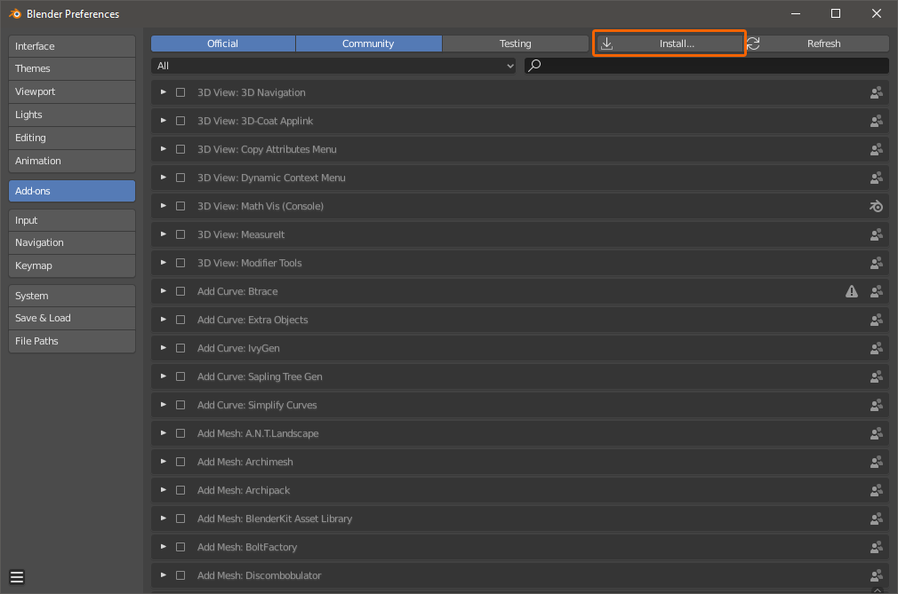
1. In the browser window that appears, select the location of the addon and click **Install**
   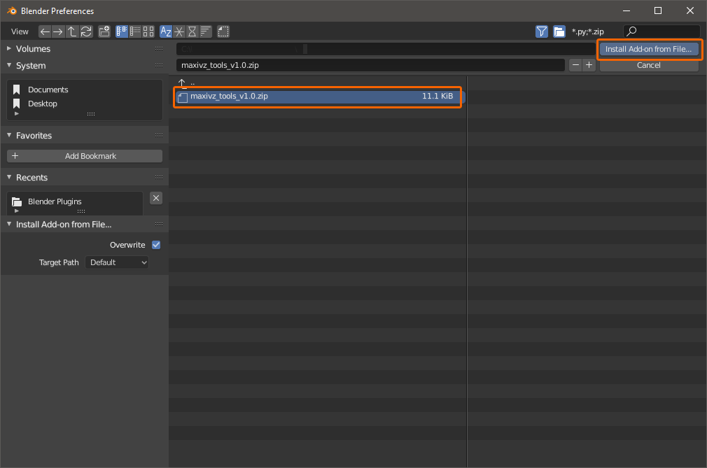
1. Now search for the Interactive Tools add-on in the list, and enable it using the checkbox
   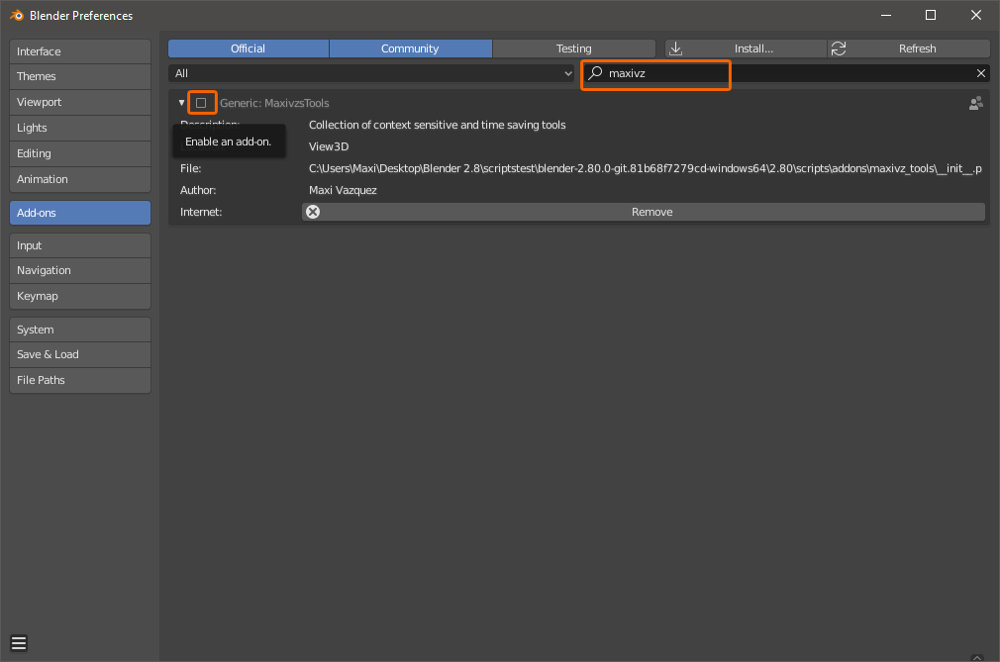

Once enabled, the tools can be found in the *Maxivz Interactive Tools* on the right side menu in Blender:
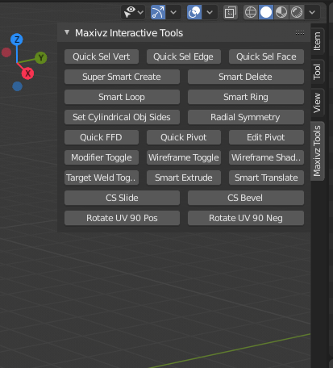

## Tools

These tools work best when assigned to hotkeys.

### Super Smart Create
This tool does many things depending on the context and selection:

* Connects verts that belong to the same face
  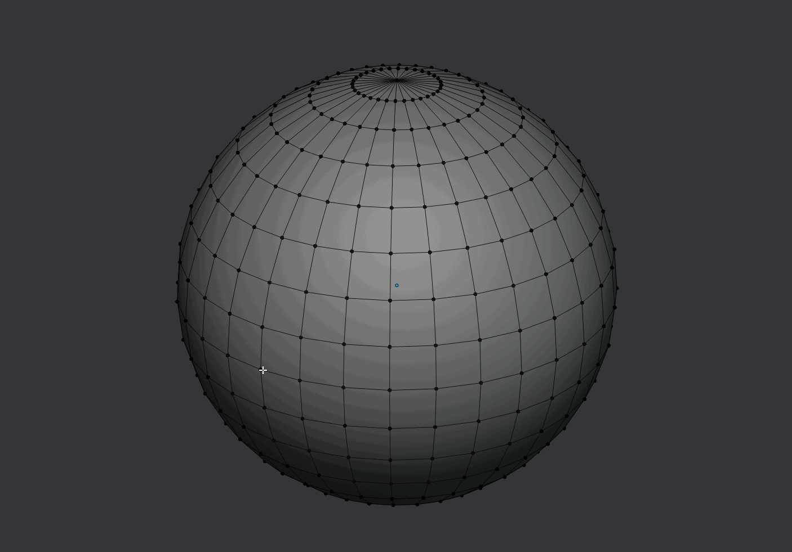
* If you select one vert or two verts that share the same edge and are on a border it will invoke f2 (make sure you have f2 enabled)
  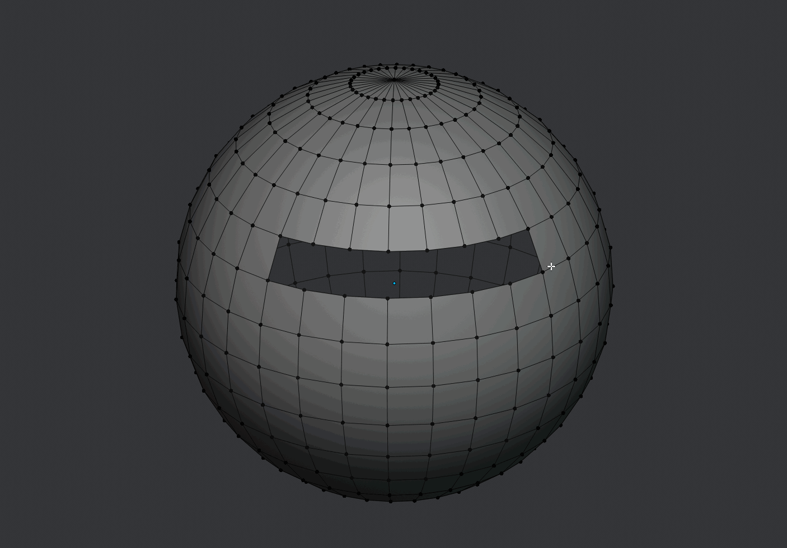
* If you select multiple verts that belong to the same face, they will all be connected to the last selected vert
  
* If you select an edge it will divide it in 2, putting a vert in the middle of the edge
  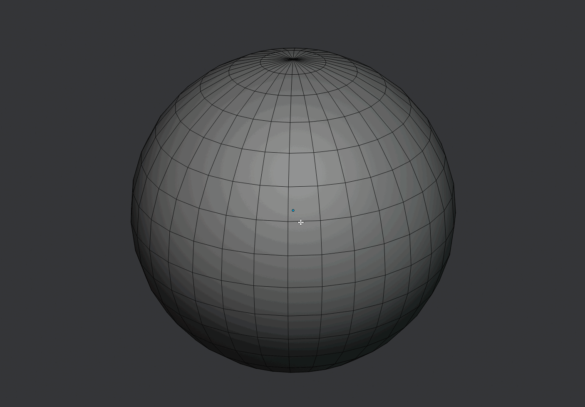
* Connects the selected edges if they are part of a ring
  
  * There are still some problems with the selection when two edge rings meet in a corner
* Caps selected borders
  
* Bridges selected edges if possible - when you select 2 adjacent edges it creates a face
  
  
* Bridges selected polys
  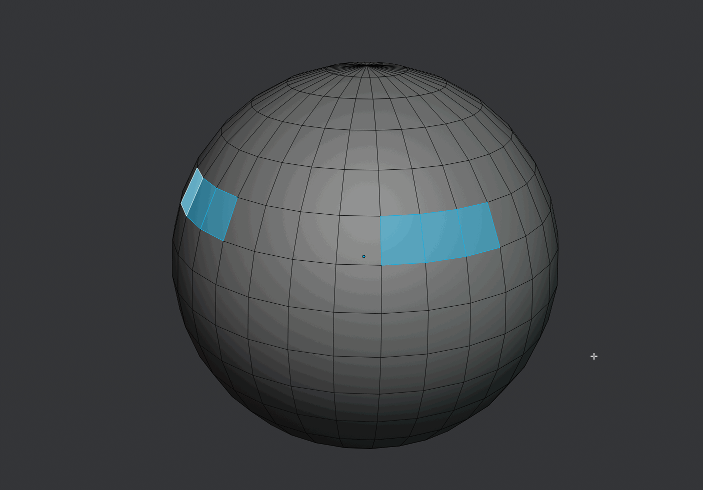
* If a single face is selected it will try to make quads on it
  
  * This feature works pretty well if you select a border, run the script to make a face and then run the script again to make quads out of it:
  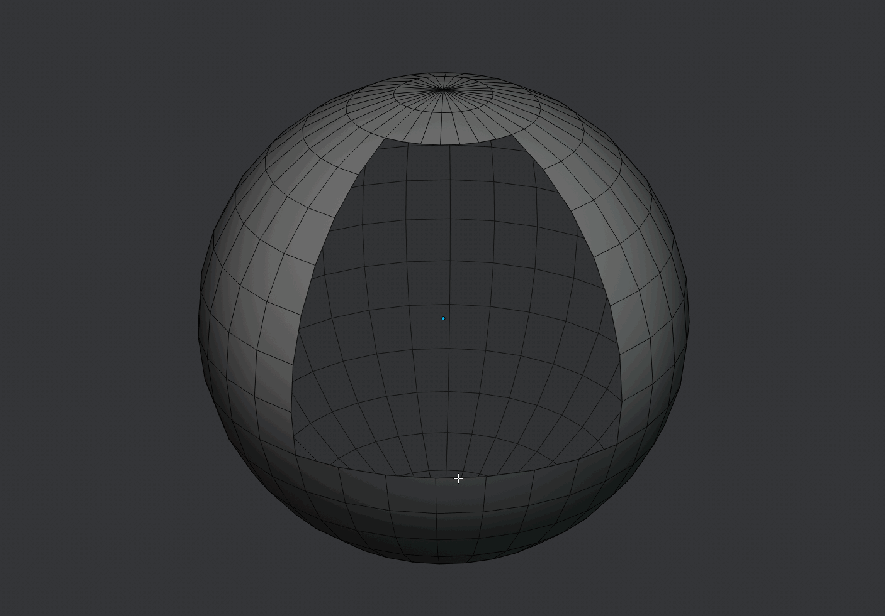

### Set Cylindrical Obj Sides
Select the loop in a cylindrical object and run the script to make a copy of the shape with customizable number of sides:

Select the created object again and run the script again to continue editing the number of sides:

### Smart Extrude
Inspired by 3dsmax shift+drag behavior.

* If in object mode it will duplicate the object and move, trying to predict the axis based in the direction you drag from
   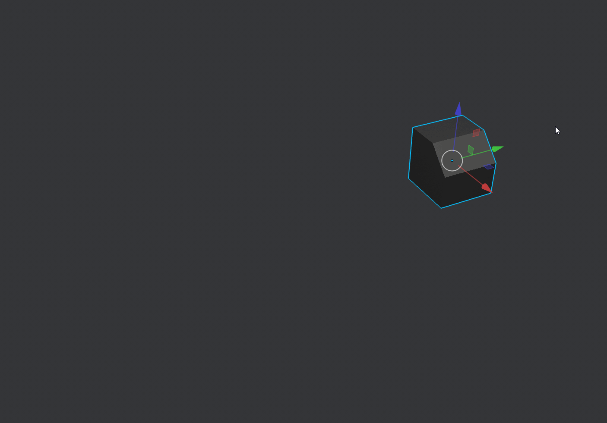
* If in edge selection mode it will extend and move, trying to predict the axis based in the direction you drag from
   
* If in vert or face selection mode it will duplicate and move, trying to predict the axis based in the direction you drag from
   
* If you are in edit mode of a curve, it will extend the curve and move, trying to predict the axis based in the direction you drag from
   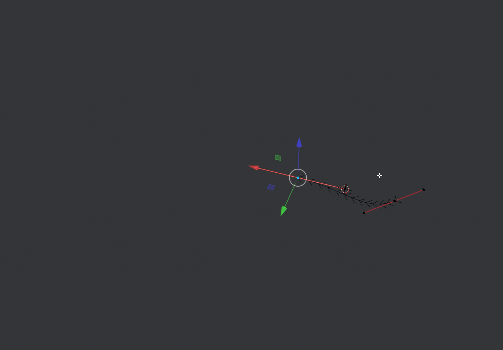

Setup a new hotkey for each 3D View tool like this, make sure to disable the default duplicate objects.

#### Future Updates
* Improve the axis detection
* Similar behaviour for rotate and scale
* Add more modifier keys (snapping, freeform, 2 axis constraint)

### Smart Translate
A tool to quickly move objects around, it tries to predict the axis of the movement based on mouse movement:

   
It's pretty simple for now and only works when assigned to the middle mouse button, a setting for this will be made in the next update.

#### Future Updates
* Improve the axis detection
* Similar behaviour for rotate and scale
* Add more modifier keys (snapping, freeform, 2 axis constraint)
* Being able to bind it to more than the middle mouse button

### Smart Loop
* If two continuous edges or one edge is selected, the edge loop is going to be selected
   
* If two edges are selected, it's going to get the edge loop between them
   
* If three edges are selected, and they have the same space between them a step selection will be made
   

These modes work with multiple selections at the same time:

Support for vertex and face mode is limited, but some modes work.

#### Future Updates
* Loop selection algorithm improvements
* Performance improvements to reduce slowdowns
* Better vertex and face mode support

### Smart Ring
* If two continuous edges or one edge is selected, the edge ring is going to be selected
   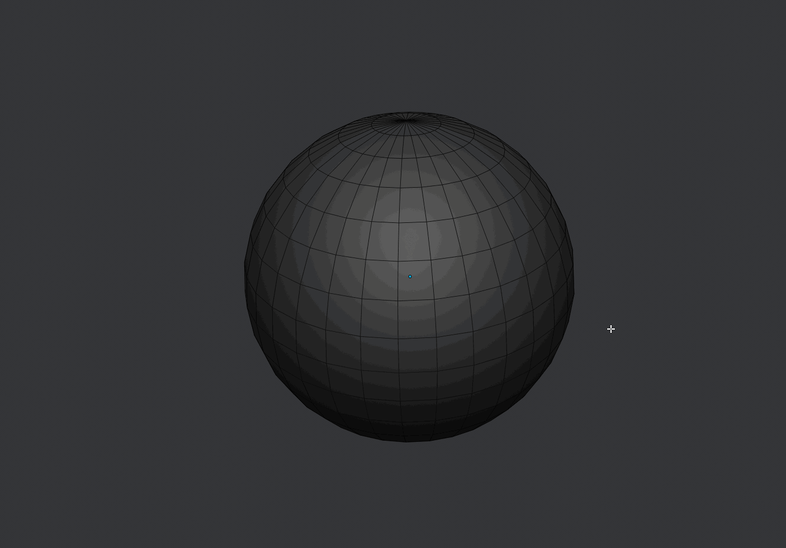
* If two edges are selected, it's going to get the edge ring between them
   
* If three edges are selected, and they have the same space between them a step selection will be made
   

These modes work with multiple selections at the same time:

Support for vertex and face mode is limited, but some modes work.

#### Future Updates
* Ring selection algorithm improvements
* Performance improvements to reduce slowdowns
* Better vertex and face mode support

### Quick FFD/Lattice
Simple, quick lattice tool that works with one hotkey.

Make a selection and run the tool. A lattice will be created and try to fit the selection. Only the selected area is affected by the lattice:
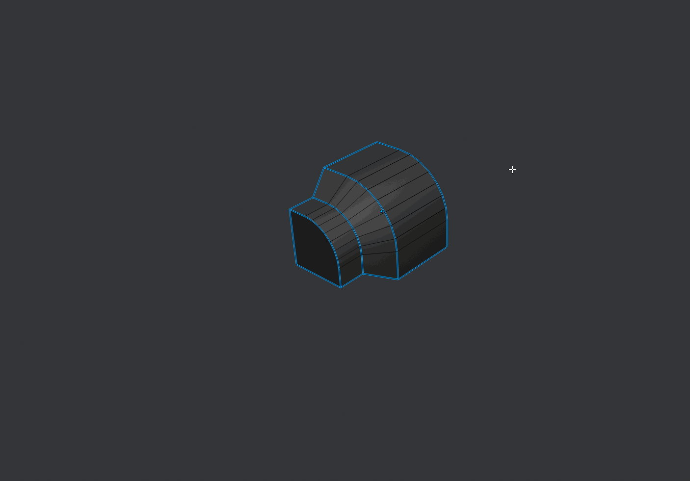

If you select the object and a lattice already exists the existing lattice will be selected:
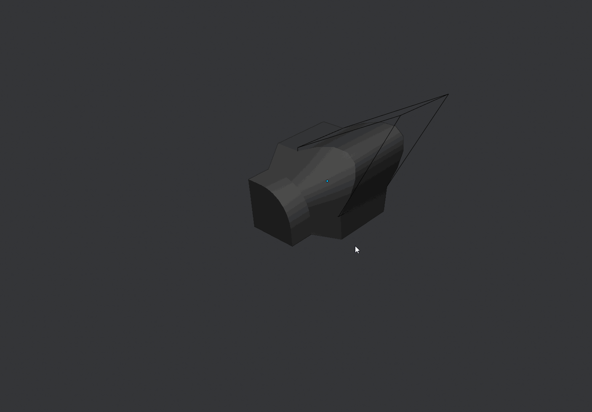

If you select the lattice and run the script the lattice will be applied and the object will be selected. The original selection is selected:

#### Future Updates
* Change FFD presets (3x3x3 and 4x4x4)
* Better support for rotations

### Quick Radial Symmetry
Select an object and run the script a radial symmetry will be created using the object's pivot point as the center point.
Move the mouse to the left and the right the amount of iterations will increase and decrease.
Control + mouse movement to change the symmetry axis.
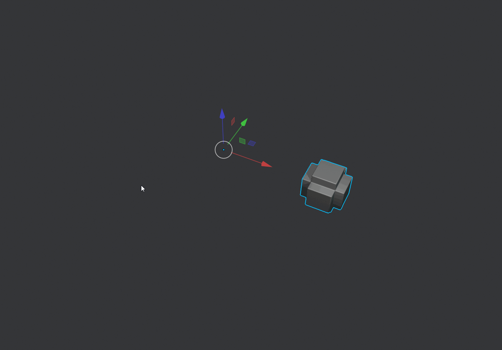

Select an object that already had radial symmetry to continue editing it.
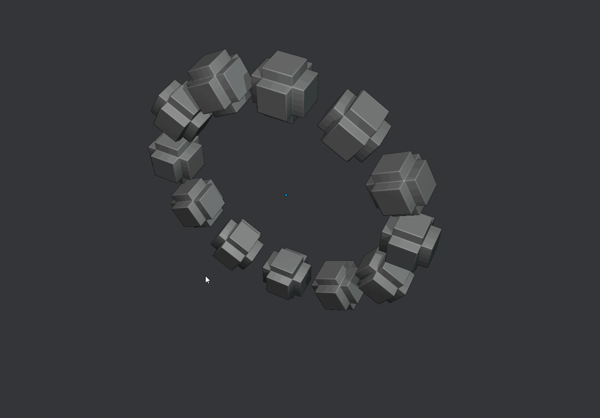

Unhide the Symmetry Pivot and move it around to further modify the radial symmetry.

### Quick Pivot
Centers the pivot on selection for vert, edge and face mode.

This works for object mode too, centering the pivot on the object.
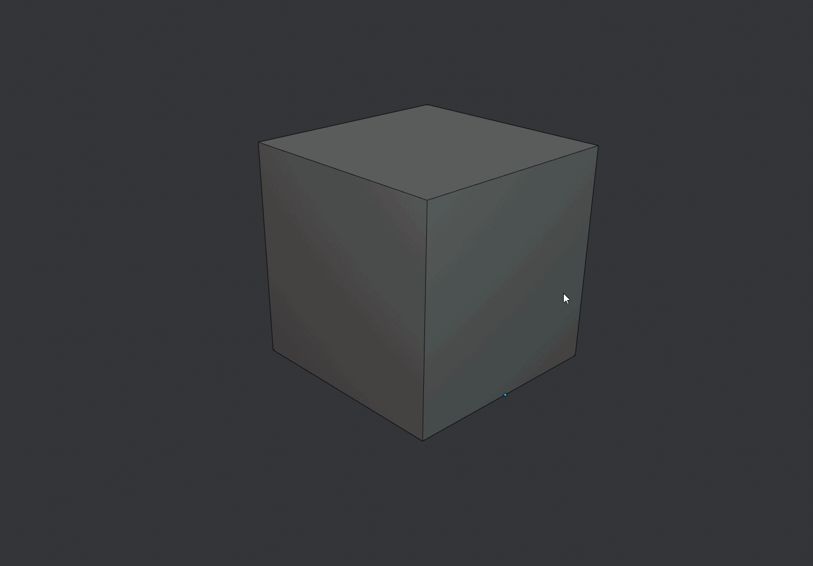

### Quick Edit Pivot
Select an object and run the script, a helper will be made, you can move this helper to your desired pivot position.

If you select the object and run the script, but a helper already existed in the scene, the existing helper will be selected.
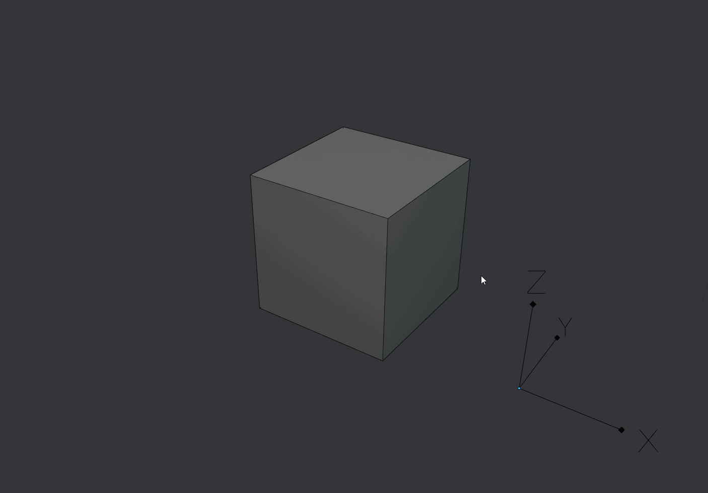

Run the script again with the helper selected to move the pivot point of the object to the position of the helper. The helper will be deleted.
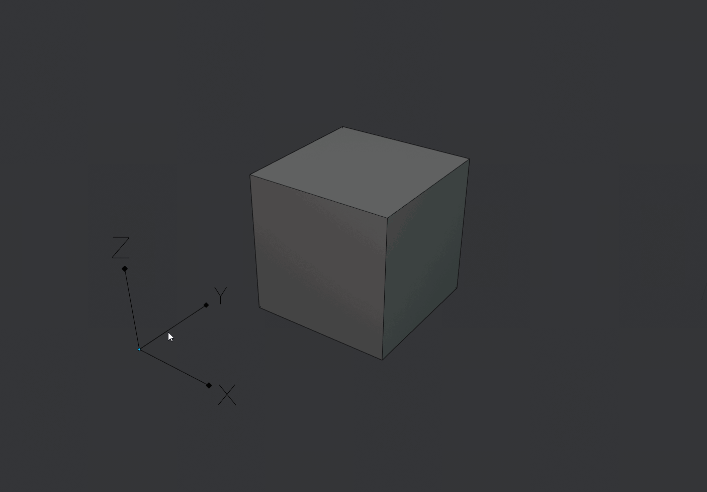

### Quick Delete
Context-sensitive deletion methods:
* If you select a vert the vert will be deleted with all the connected faces
  
* If you select an edge the edge will be dissolved
  
* If you select a border the border and the connected faces will be deleted
  
* If you select a face the face will be deleted
  
* If you select an object, the object will be deleted
  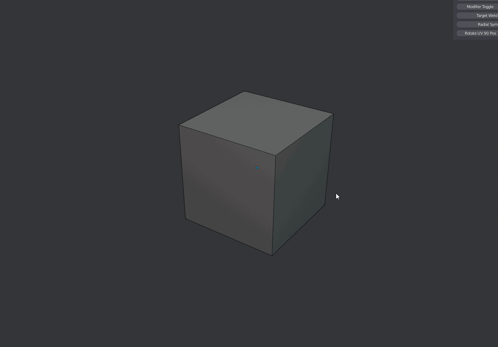

### Quick Vert Mode
* If you are in object mode it will switch to vert selection mode
* If you are in face or edge mode it will switch to vert mode
* If you are in vertex selection mode it will switch to object mode
* If the selected object is a curve, and you are in object mode it will switch to edit mode
* If you are in the curve edit mode it will switch to object mode

### Quick Edge Mode
* If you are in object mode it will switch to edge selection mode
* If you are in vert or face mode it will switch to edge mode
* If you are in edge selection mode it will switch to object mode
* If the selected object is a curve, and you are in object mode it will switch to edit mode
* If you are in the curve edit mode it will switch to object mode

### Quick Face Mode
* If you are in object mode it will switch to face selection mode
* If you are in vert or edge mode it will switch to face mode
* If you are in face selection mode it will switch to object mode
* If the selected object is a curve, and you are in object mode it will switch to edit mode
* If you are in the curve edit mode it will switch to object mode

### CS Bevel
Context sensitive bevel:
* If vertex mode is selected it will execute the vertex chamfering tool
  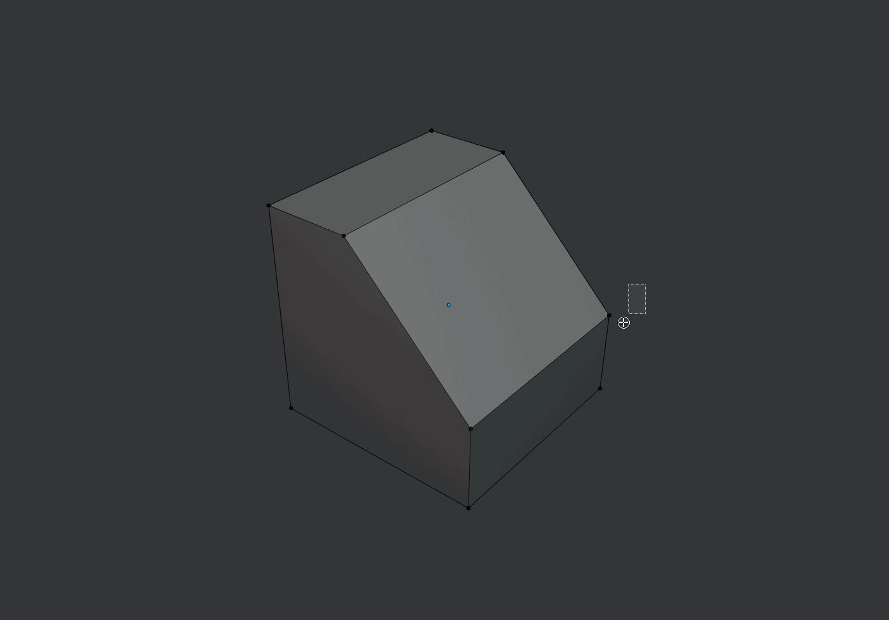
* If edge mode is selected it will execute the edge bevel tool
  
* If face mode is selected it will execute the extrude faces tool - this replicates 3ds Max face bevel behaviour
  

### CS Slide
Simple context sensitive slide:
* If you are in vert mode it will execute vert slide
* If you are in edge mode it will execute edge slide

### Modifier Toggle
Toggles on and off all the modifiers of the selected object.
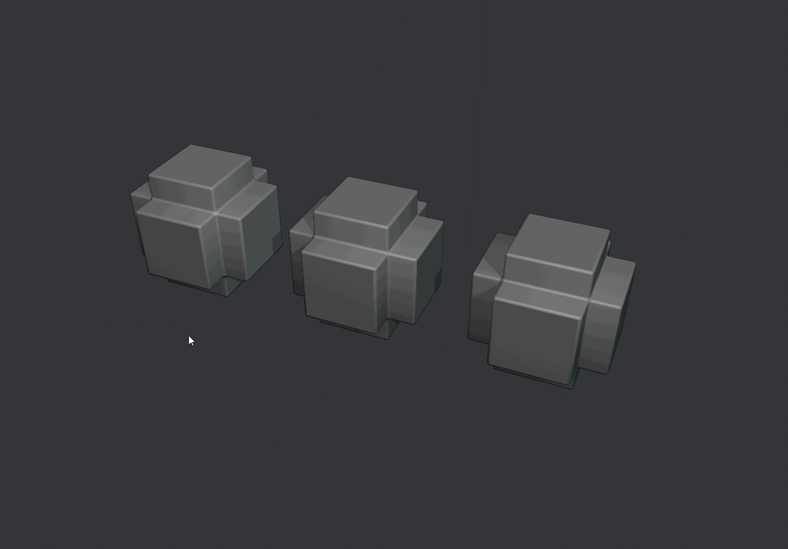

### Wireframe Toggle
Toggles the wireframe rendering on and off.

### Wire Shaded Toggle
Toggles between the shaded and the wireframe mode.

### Target Weld Toggle
Toggles between vert snap and auto merge on and off.
Recreates 3ds max target weld behaviour by activating the tool and moving the verts you want to merge to the vert you want to merge to.

### UV Rotate 90 pos
Rotates the UV selection 90 degrees.

### UV Rotate 90 neg
Rotates the UV selection -90 degrees.

### UVs From Sharps
Applies seams from sharp edges and unwraps everything.
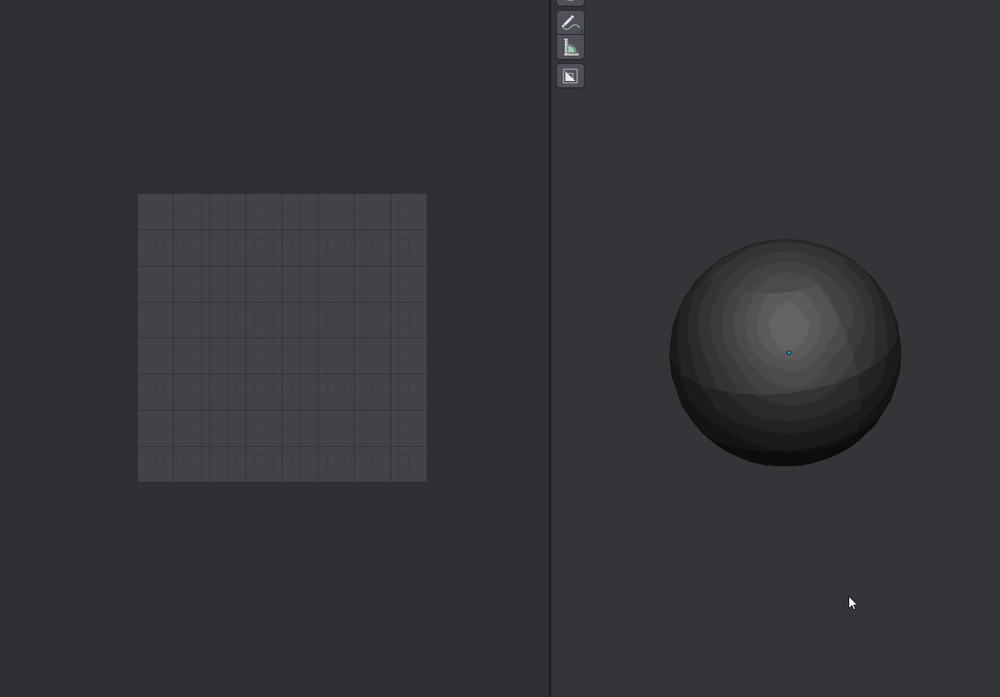
