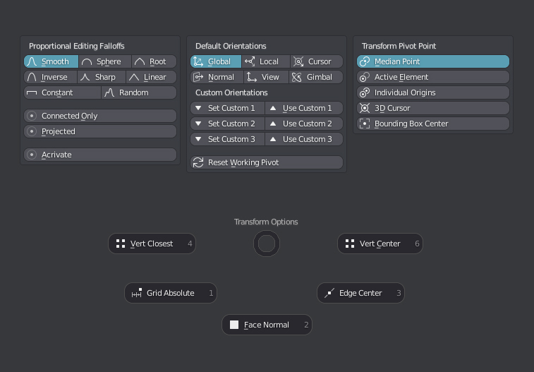
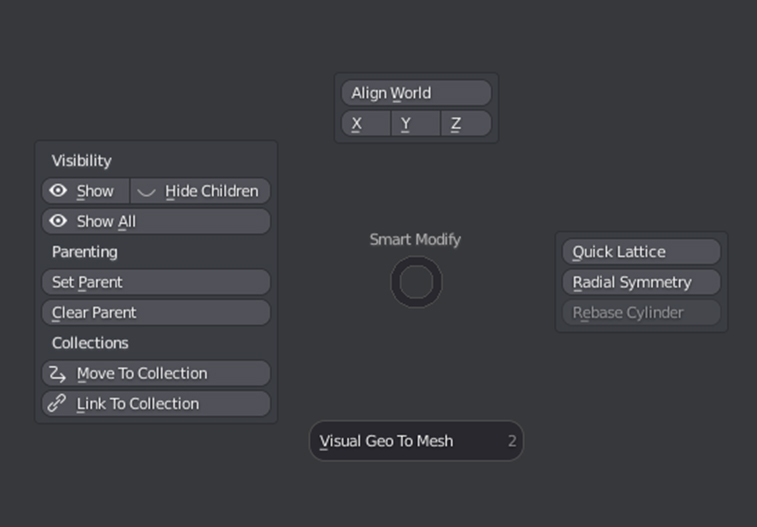
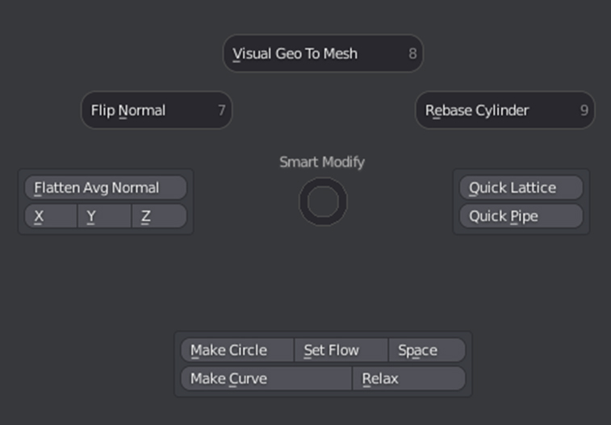
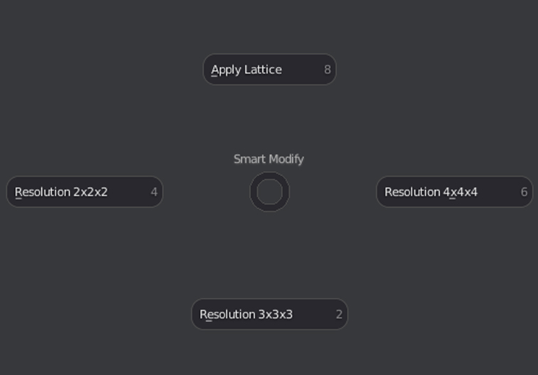
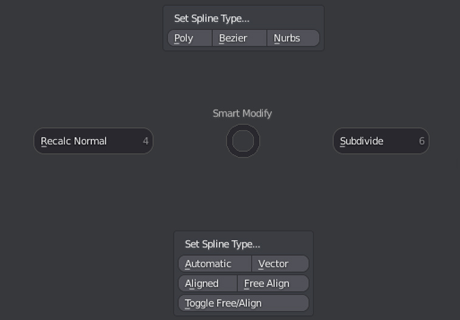
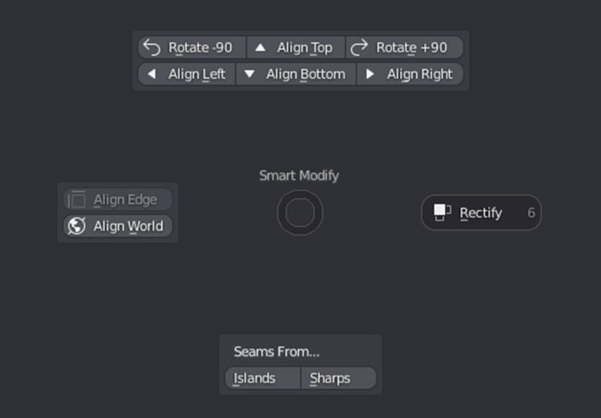

# Pie Menus

##Transform Options Pies

###Proportional Editing Falloffs
Allows access to all the Proportional Editing Falloffs as well as activating and deactivating it.
###Transform Orientations
Allows access to all the default orientations as well as quickly setting 3 custom orientations. 

Reset Orientation enables to the last used default orientation if using a custom orientation 

###Transform Pivot Point
Allows access to all the Transform Pivot Points.

###Snap Presets
Quick snap presets that set multiple snaping options at once

* **Vert Closest:**  Snaps to closest vertex.

* **Vert Center:** Snaps to vertex center.

* **Grid Absolute:** Snaps to the closest increment in absolute mode.

* **Face Normal:** Snaps position and alignment to the center of a face

* **Edge Center:** Snaps to the edge's middle point.

##Smart Modify Pie
Context Sensitive Pie Menu, gives quick access to relevant tools based on the context.
###Object Mode

###Edit Mesh Mode

###Lattice Mode

###Curve Mode

###UV Mode

Requires textools

