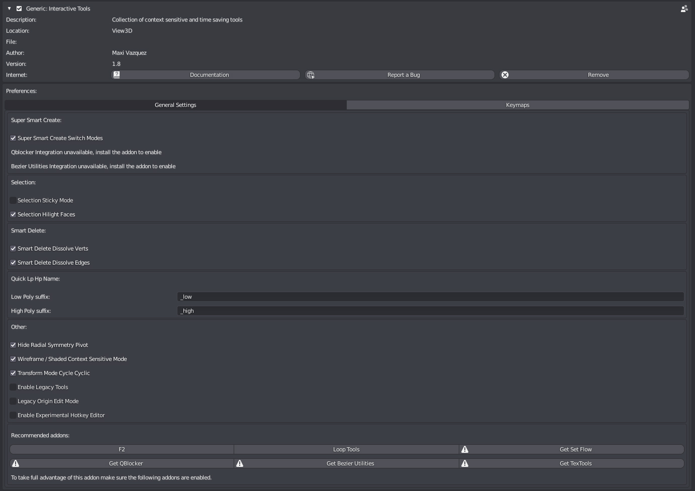

##Preferences

###General Settings

####Super Smart Create

**Super Smart Create Switch Modes: **
Enables Switching to optimal selection mode after certain operations in Super Smart Create.

**Super Smart Create QBlocker Integration: **
Use QBlocker for primitive creation, needs QBlocker to be used.

**Super Smart Create Bezier Utilities Integration: **
Use Flexi Bezier Tool for spline creation, needs Beier Utilities to be used.

####Selection
**Selection Sticky Mode: **
Enables Sticky Selection when using Quick Select Modes and Selection Cycle.

**Selection Hilight Faces:**
Enables Face Hilighting when using Quick Select and Selection Cycle Modes.

####Smart Delete
**Smart Delete Dissolve Verts: **
Verts will be dissolved, if disabled they will be deleted.

**Smart Delete Dissolve Edges: **
Non-border edges will be dissolved, if disabled they will be deleted.

####Quick Lp Hp Namer
**Low Poly suffix: **
Suffix to use for Low Poly Meshes.

**High Poly suffix: **
Suffix to use for High Poly Meshes.

####Other

**Hide Radial Symmetry Pivot: **
Hide Radial Symmetry Pivot on symmetry creation.

**Wireframe / Shaded Context Sensitive Mode: **
Enables context sensitive mode for the Wireframe / Shaded Tool.

**Legacy Origin Edit Mode**
Enable Legacy Origin Edit Mode.

**Enable Legacy Tools**
Enable Legacy Tools that are no longer in active development or supported. Use at own risk.

**Enable Experimental Hotkey Editor**
Enables the hotkey editor in Itools Preference Pannel, this is a experimental feature, enable at own risk.

####Recommended Addons
List of recommended addons that can be integrated in Interactive Tools to extend its features. 

Addons that have the warning sign are not installed or enabled.

You can go to the respective addon download page by clicking over its name.

###Keymaps
Keymap editor, disabled by default as its a work in progress feature. Can be enabled from General Settings but bugs can be expected.