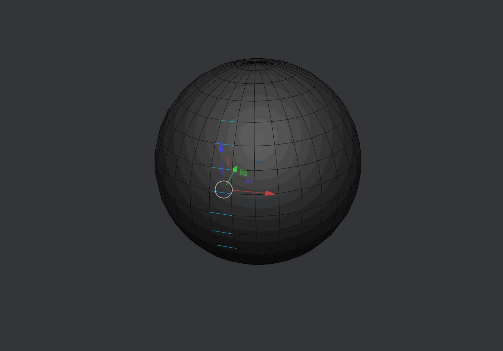
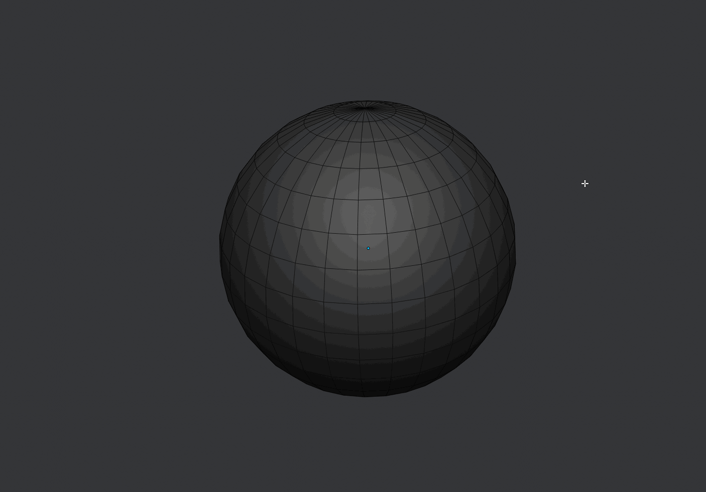

##Selection

###Quick Vert Mode

####Mesh Mode

*	If you are in object mode it will switch to vert selection mode.

*	If you are in face or edge mode it will switch to vert mode.

*	If you are in vertex selection mode it will switch to object mode.

####Curve Mode

*	If the selected object is a curve, and you are in object mode it will switch to edit mode.

*	If you are in the curve edit mode it will switch to object mode.

####Grease Pencil Mode

*	If you are in object mode it will switch to point selection mode.

*	If you are in stroke or segment mode it will switch to point mode.

*	If you are in point selection mode it will switch to object mode.

###Quick Edge Mode

####Mesh Mode

*	If you are in object mode it will switch to edge selection mode.

*	If you are in vert or face mode it will switch to edge mode.

*	If you are in edge selection mode it will switch to object mode.

####Curve Mode

*	If the selected object is a curve, and you are in object mode it will switch to edit mode.

*	If you are in the curve edit mode it will switch to object mode.

####Grease Pencil Mode

*	If you are in object mode it will switch to stroke selection mode.

*	If you are in point or segment mode it will switch to stroke mode.

*	If you are in stroke selection mode it will switch to object mode.

###Quick Face Mode

####Mesh Mode

*	If you are in object mode it will switch to face selection mode.

*	If you are in vert or edge mode it will switch to face mode.

*	If you are in face selection mode it will switch to object mode.

####Curve Mode

*	If the selected object is a curve, and you are in object mode it will switch to edit mode.

*	If you are in the curve edit mode it will switch to object mode.

####Grease Pencil Mode

*	If you are in object mode it will switch to segment selection mode.

*	If you are in point or stroke mode it will switch to segment mode.

*	If you are in segment selection mode it will switch to object mode.

###Sticky Selection

Sticky selection refeers to keeping the selection stored between different selection modes in a similar way to what 3ds Max does.

Interactive Tool's Sticky Selection implementation works by storing the selected verts, edges or faces as a custom attribute, for this to happen
you need to enable Sticky Selection in the [**preferences**](../Preferences) and use Quick Vert, Edge and Face or Selection Cycle to move between modes.

While this feature works most of the times, doing a lot of operations that modifies the order of the elements and forces blender to recalculate it, like extruding, beveling, 
etc will break the tool.

###Smart Loop
If two continuous edges or one edge is selected, the edge loop is going to be selected.

If two edges are selected, it's going to get the edge loop between them.

If three edges are selected, and they have the same space between them a step selection will be made.

These modes work with multiple selections at the same time.

---

Support for vertex and face mode is limited, but some modes work.

---

###Smart Ring
If two continuous edges or one edge is selected, the edge ring is going to be selected.

If two edges are selected, it's going to get the edge ring between them,

If three edges are selected, and they have the same space between them a step selection will be made.

These modes work with multiple selections at the same time.

---

Support for vertex and face mode is limited, but some modes work.

There is a known bug with ring selections not working sometimes, a fix will be released on the future.

---
