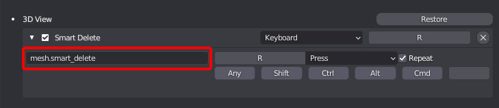

##Setup
###Installation

To install the tools inside Blender, follow these steps:

1. In Blender's top menu, go to **Edit -> Preferences**, choose the **Add-ons** section in the Preferences panel and click the **Install** button

2. In the browser window that appears, select the location of the addon and click **Install**

3. Now search for the Interactive Tools add-on in the list, and enable it using the checkbox

4. Once enabled, the tools can be found in the Interactive Tools pannel on the right side menu in Blender

####Alternative

1. Go to C:\Users\ **username** \AppData\Roaming\Blender Foundation\Blender\ **blender_version** \scripts\addons
and unpack the contents of the rar file

2. In Blender's top menu, go to **Edit -> Preferences**, choose the **Add-ons** section in the Preferences panel. In the browser window that appears, select the location of the addon and click **Install**

3. Now search for the Interactive Tools add-on in the list, and enable it using the checkbox

4. Once enabled, the tools can be found in the Interactive Tools pannel on the right side menu in Blender

###Updating
1. Get the latest version from [**Github**](https://github.com/maxivz/interactivetoolsblender)

2. In Blender's top menu, go to **Edit -> Preferences**, choose the **Add-ons** section in the Preferences panel and search for Interactive Tools

3. Click Remove to delete the current version of the addon

4. Install the plugin again using the new version

####Alternative
1. Get the latest version from [**Github**](https://github.com/maxivz/interactivetoolsblender)

2. Go to C:\Users\ **username** \AppData\Roaming\Blender Foundation\Blender\ **blender_version** \scripts\addons
and unpacking the contents of the rar file, make sure to overwrite the files from the old version of the plugin

3. Restart Blender if it was open

###Hotkey Setup
To get the most out of the tools you can add custom keymaps for the tools.
You can learn more on how to set up custom Keymaps in  [**Blenders Manual**](https://docs.blender.org/manual/en/latest/editors/preferences/keymap.html)

####Tool List
To make it easier to setup hotkeys for specific tools, here's a list of all the tools and their operator ID Names.

The operator ID Name dictates what tool is used when a key is pressed

#####Modes Cycling

* **Selection Mode Cycle:** mesh.selection_mode_cycle
* **Transform Mode Cycle:** mesh.transform_mode_cycle
* **Transform Orientation Cycle:** mesh.transform_orientation_cycle

#####Selection

* **QS Vert:** mesh.quick_selection_vert
* **QS Edge:** mesh.quick_selection_edge
* **QS Face:** mesh.quick_selection_face
* **Smart Loop:** mesh.smart_select_loop
* **Smart Ring:** mesh.smart_select_ring

#####Transform

* **CS Move:** mesh.cs_move
* **CS Rotate:** mesh.cs_rotate
* **CS Scale:** mesh.cs_scale

#####Tools

* **Super Smart Create:** mesh.super_smart_create
* **Smart Delete:** mesh.smart_delete
* **Smart Extrude:** mesh.smart_extrude
* **Quick Origin:** mesh.quick_pivot
* **Edit Origin:** mesh.simple_edit_pivot
* **Quick Align:** mesh.quick_align
* **Quick Pipe:** mesh.quick_pipe
* **Quick Lattice:** mesh.quick_lattice
* **Rebase Cylinder:**  bpy.ops.mesh.rebase_cylinder
* **Radial Symmetry:** bpy.ops.mesh.radial_symmetry
* **CS Slide:** mesh.context_sensitive_slide
* **CS Bevel:** mesh.context_sensitive_bevel
* **Quick HP Lp Namer:** mesh.quick_hplp_namer

#####Pie Menus
* **Smart Modify Pie:** mesh.smart_modify
* **Transform Options Pie:** mesh.transform_options_pie

#####Toggles 
* **Modifiers On/Off:** mesh.modifier_toggle
* **Target Weld On/Off:** mesh.target_weld_toggle
* **Wireframe On/Off:** mesh.wire_toggle
* **Wire/Shaded bpy:** mesh.wire_shaded_toggle

#####Uv Tools
* **Rotate 90+:**  uv.rotate_90_pos
* **Rotate 90-:** uv.rotate_90_neg
* **Seams From Sharps:** uv.seams_from_islands
* **Seams From Islands:** uv.seams_from_sharps
* **Uvs From Sharps:** uv.uvs_from_sharps
