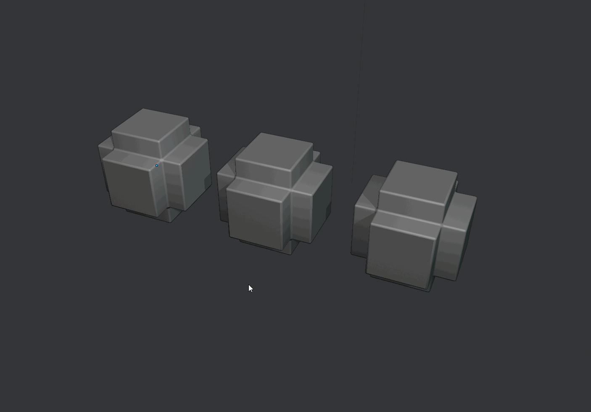

##Toggles
###Modifiers On/Off
Toggles modifiers on and off all the selected object.

###Target Weld On/Off
Toggles between vert snap and auto merge on and off. Recreates 3ds max target weld behaviour by activating the tool and moving the verts you want to merge to the vert you want to merge to.

###Wireframe On/Off
Toggles wireframe rendering on and off.

###Wire/Shaded
Toggles between shaded and the wireframe mode.
