# Smart Tools
Customizable context sensitive tools that pack multiple functions in one hotkey
##Super Smart Create

This tool executes many creation based operations depending on the context and selection, allowing to pack a lot of actions in one hotkey.

####Object Mode
Brings up an object creation Pie Menu if nothing is selected.

Bring up a duplication menu if at least a object is selected.
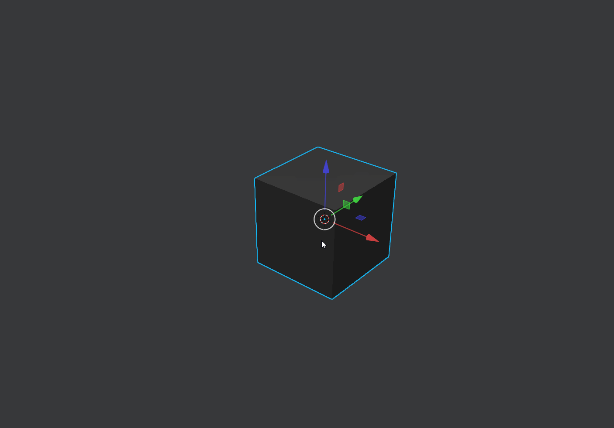

####Vert Mode
If Nothing is selected it executes the cut tool.
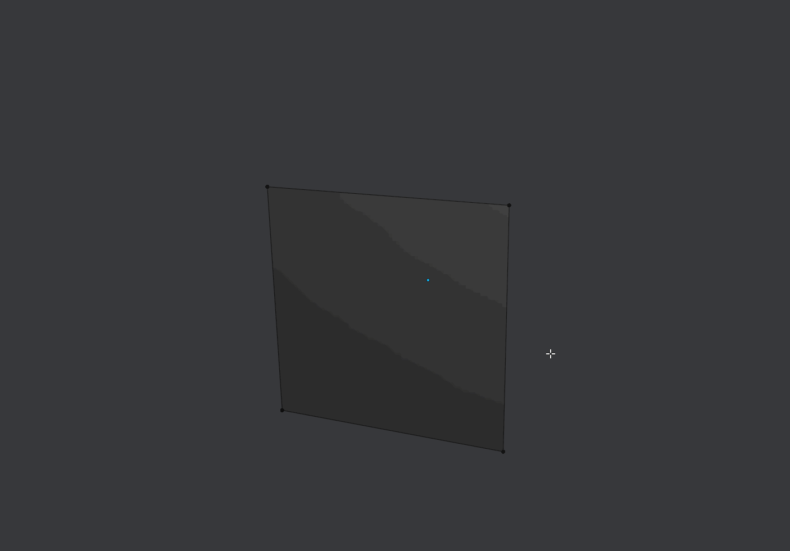

Connects verts that belong to the same face.

If you select one vert or two verts that share the same edge and are on a border it will invoke f2 (make sure you have f2 enabled)

If you select multiple verts that belong to the same face, they will all be connected to the last selected vert.
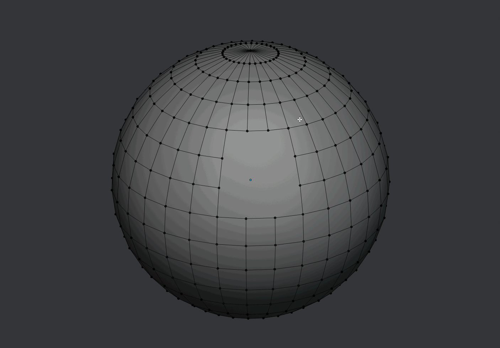

####Edge Mode
If nothing is selected it invokes the edge loop tool

If you select an edge it will divide it in 2, putting a vert in the middle of the edge

Connects the selected edges if they are part of a ring.

Caps selected borders

Bridges selected edges if possible

When you select 2 adjacent edges it creates a face
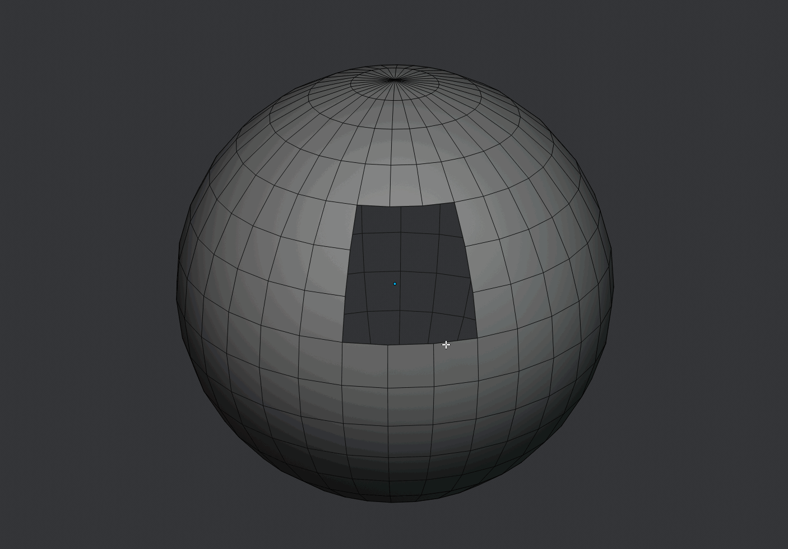

####Face Mode
Bridges selected polys

If a single face is selected it will try to make quads on it

This last feature works pretty good if you select a border, run the script to make a face and then run the script again to make quads out of it:

When Mmltiple connected faces are selected they will be subdivided
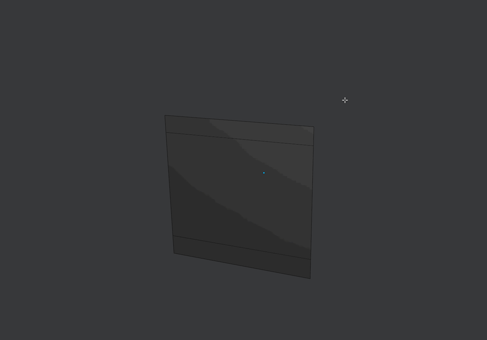

####Curve Mode
If one point is selected it will extrude it
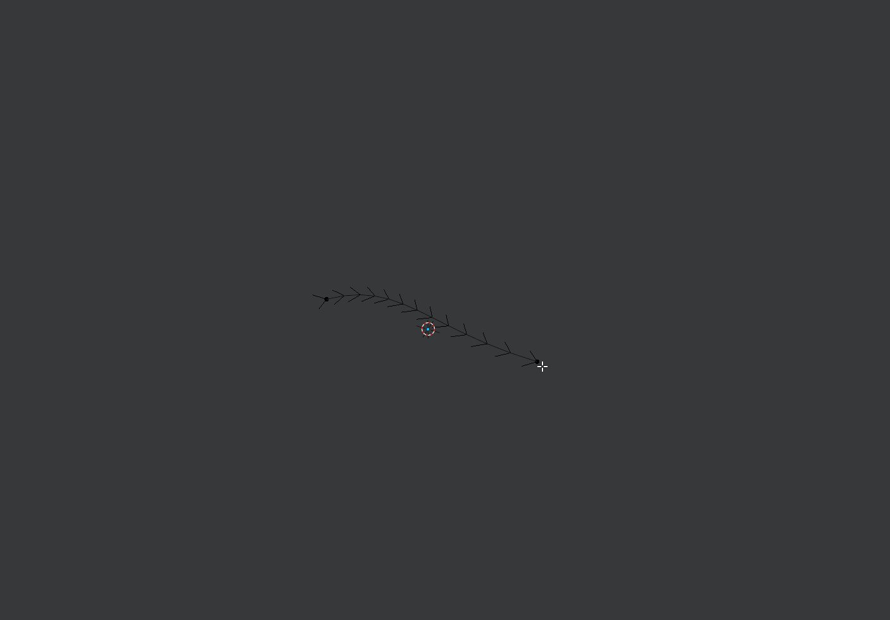

If two unconnected points are selected it will connect them

If two connected points are selected it will make a segment between them

##Smart Delete
####Vert Mode
If a vert is selected it will delete all the connected faces.

	Option to dissolve the vert instead can be found in the preferences.
	
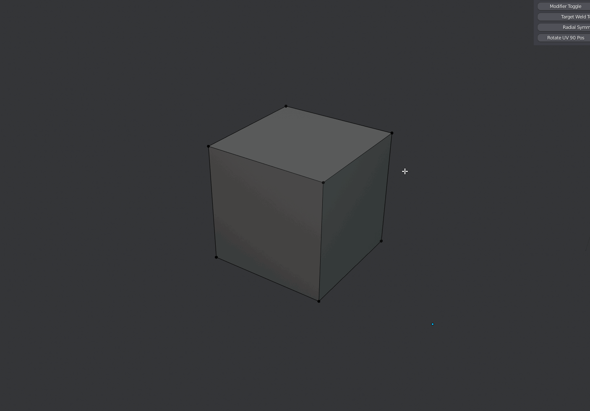

##Smart Extrude
###Current Method
If the tool is run in object mode the selected objects will be duplicated and the transform tool that was being used is ran.

If the tool is run in edit mode while in edge mode the selected edges will be extruded and the transform tool that was being used is ran.

If the tool is run in edit mode while in face mode the selected  the faces will be duplicated and the transform tool that was being used is ran.

If the tool is run in edit curve mode while in point mode the selected the points will be duplicated and the transform tool that was being used is ran.

###Legacy Method
The legacy mode of this tool can be activated in the [**preferences**](../Preferences) .
 The main feature of the legacy mode is automatic axis detectionbut it only works with the move tool
 and its behaivour isnt consistent.

###Mouse Drag Setup
For mouse drag behaivour set up a new hotkey as shown in the picture below. The 3d View Tool is a good context to set the tool under, but this can be done under any context.
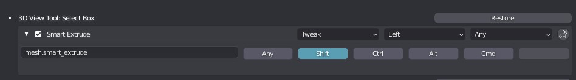

##Quick Origin
###Edit Mode
Centers the origin on selection for vert, edge and face mode.

###Object Mode
Works as well for object mode, centering the origin on the object.

##Quick Edit Origin
###Current Mode

	This mode only works in versions newer than 2.82

Toggles edit origin mode on and off.

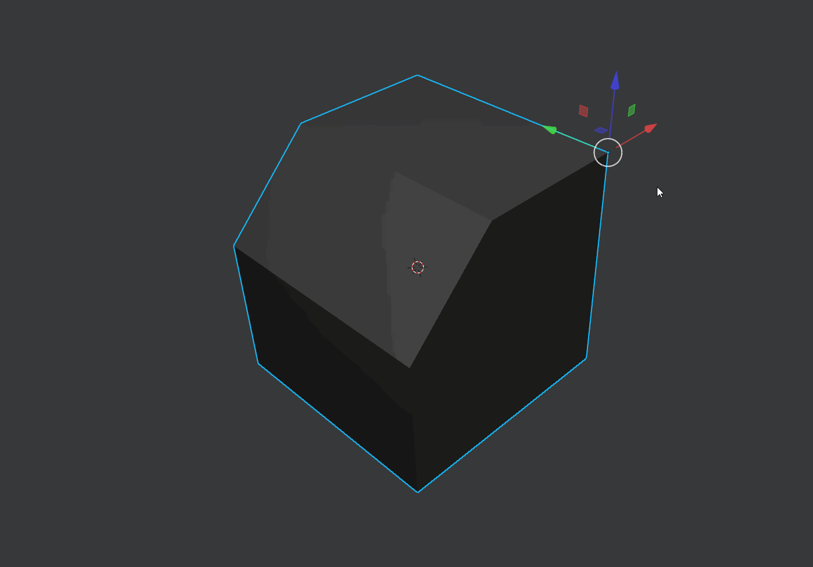

###Legacy Mode

For blender 2.82 and below the tool will run in legacy mode. 

This mode can also be enabled in newer versions of blender in the [**preferences**](../Preferences).

Select an object and run the tool, a helper will be made to control the origin position.
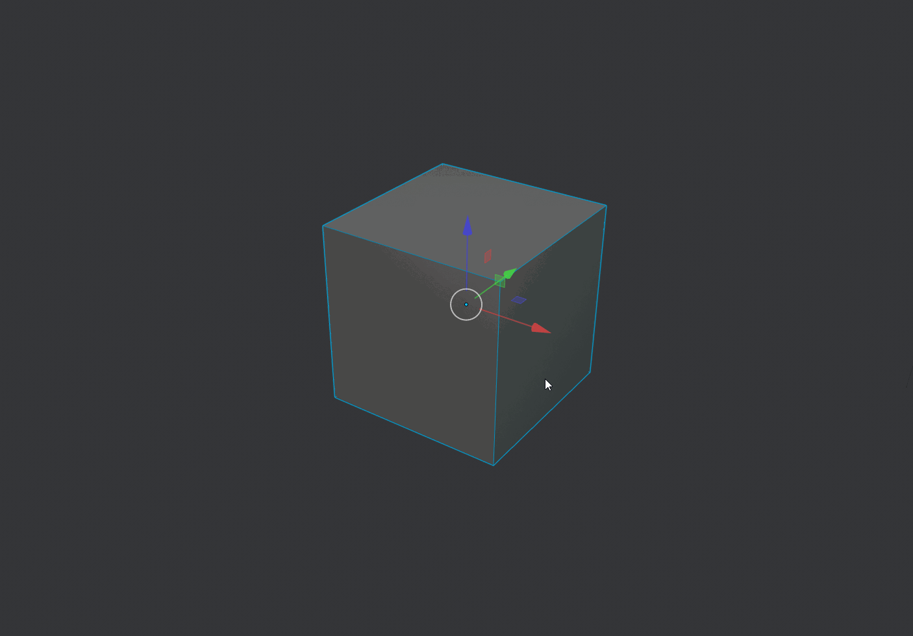

If the selected object already has a helper on the scene the existing helper will be selected.

With the helper selected run the tool to apply the new origin position to the object.

##Quick Align
If an object is selected hover the cursor over the target and run to tool to align the mesh to the target.
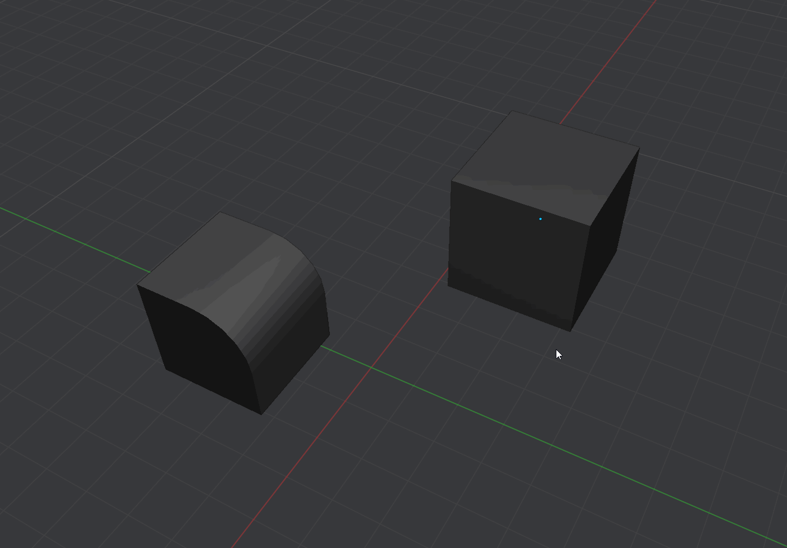

If an object is selected and no mesh is under the cursor the mesh will be aligned to the world. 
The settings menu can be used to align to specific axes.
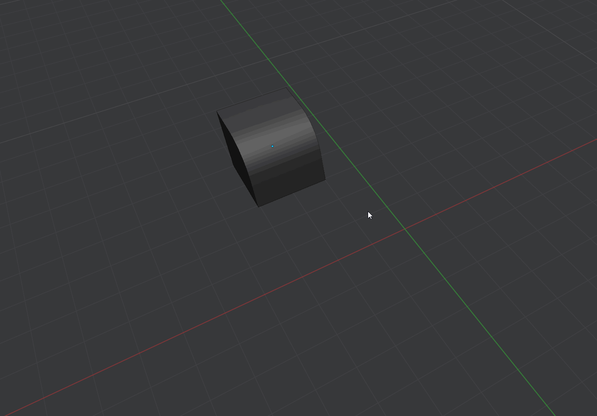
##Quick Pipe
Makes a Pipe from an edge selection, can also be run on existing pipes to continue editing.

---

* Move Left/Right to controls the thickness of the pipe.
* Ctrl + Mouse Left/Right controls the resolution of the pipe.

---

##Quick Lattice
If a selection is made a lattice that fits the selection will appear. This works in Object mode as well

If the object is selected and the tool is run when a lattice already exists then the existing lattice will be selected.

If the lattice is selected and the tool is run lattice will be applied and the object will be selected.
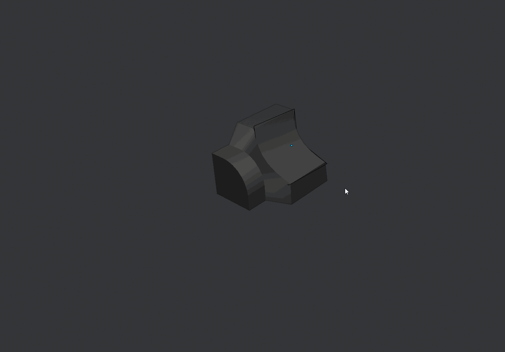

##Rebase Cylinder
---

* Move Left/Right to controls the resolution of the cylinder.
* Ctrl + Mouse Left/Right controls the axis in which the cylinder is calculated.
* M to change between different merge distance presets

---
Select a loop in a cylindrical object and run the tool to make a copy of the shape with customizable number of sides.
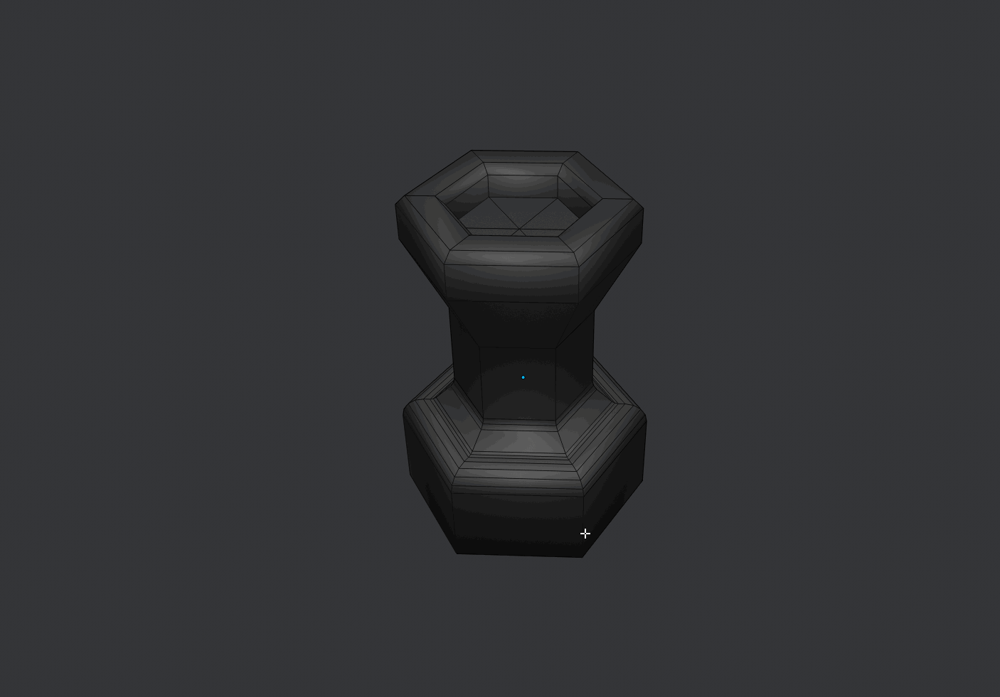

The tool can be run on rebased cylinders to continue editing after they have been created as long as the modifiers havent been collapsed.
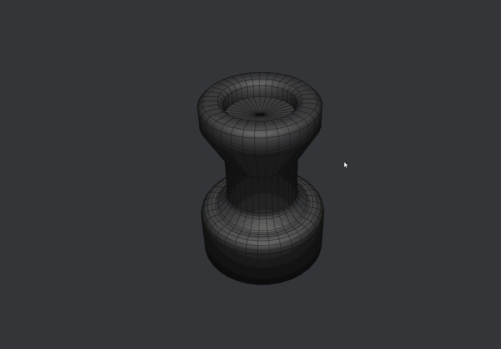

##Radial Symmetry 
---

* Move the mouse to the left and the right the amount of iterations will increase and decrease.

* Control + mouse movement changes the symmetry axis.

* H To Show/Hide the symmetry Origin.

---

Select an object and run the tool. A radial symmetry will be created using the object's pivot point as the center point.

Select an object that already had radial symmetry to continue editing it.

Unhide the Symmetry Pivot and move it around to further modify the radial symmetry.

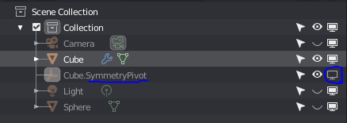

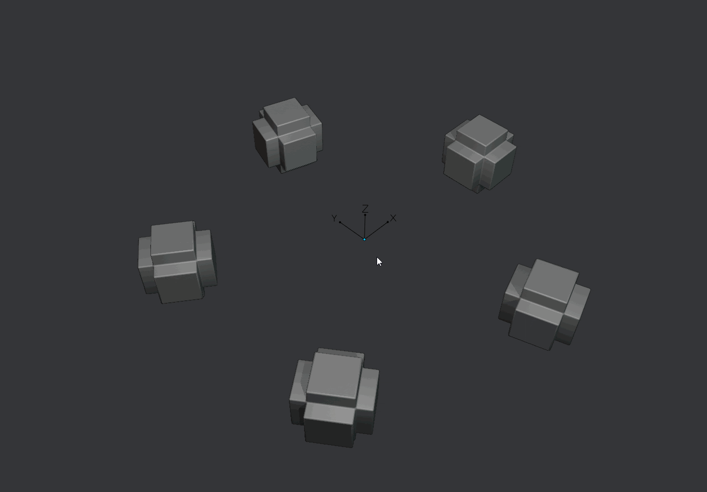

##CS Slide
###Vert Mode
If the vert mode it will execute vert slide.
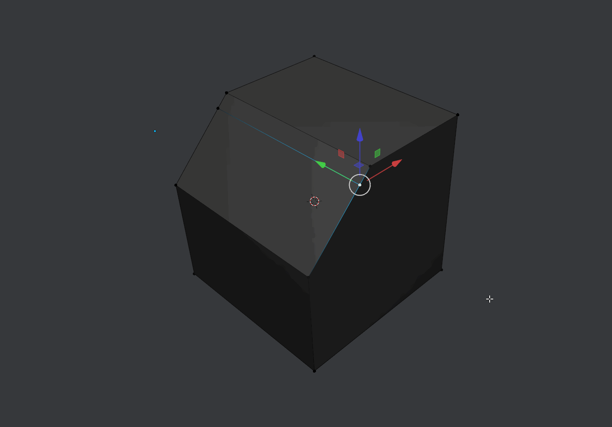

####Edge Mode
If the edge mode it will execute edge slide.
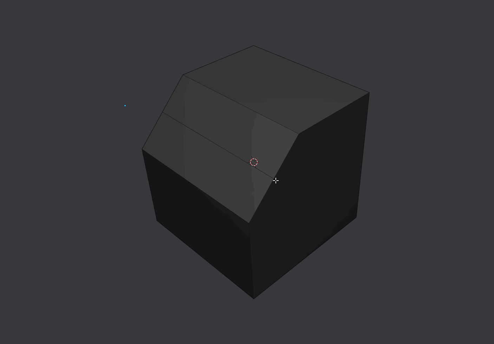

##CS Bevel
###Vert Mode
If the vert mode is selected it will execute the vertex bevel tool.

####Edge Mode
If the edge mode it selected it will execute the edge bevel tool.

####Face Mode
If the face mode is selected it will execute the extrude faces tool. 

##Quick HP Lp Namer
Finds the lowest poly mesh in the selection and adds the low poly suffix to it, then proceeds to name all the high poly meshes with the low poly name adding the high poly prefix.

The prefix for the low and high poly mesh can be changed in the plugin settings.
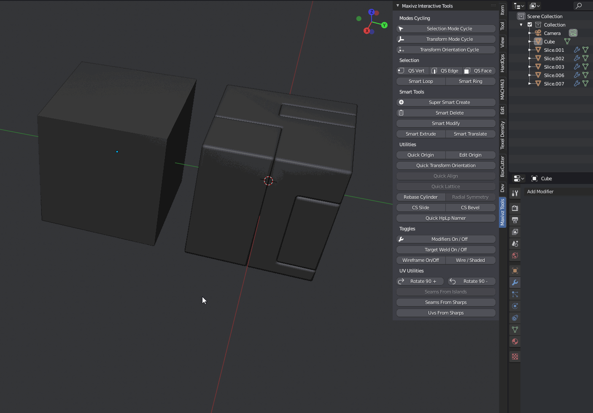
