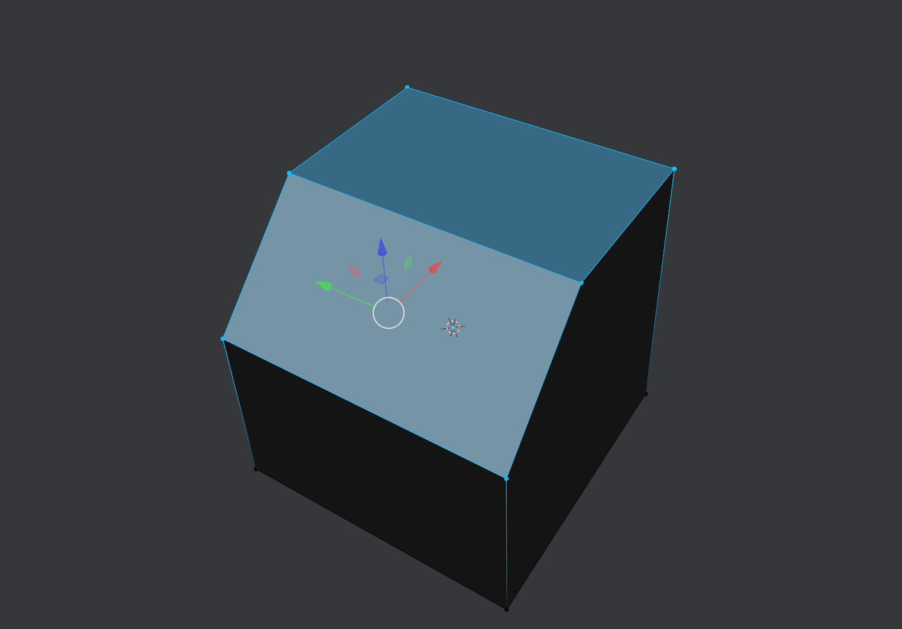
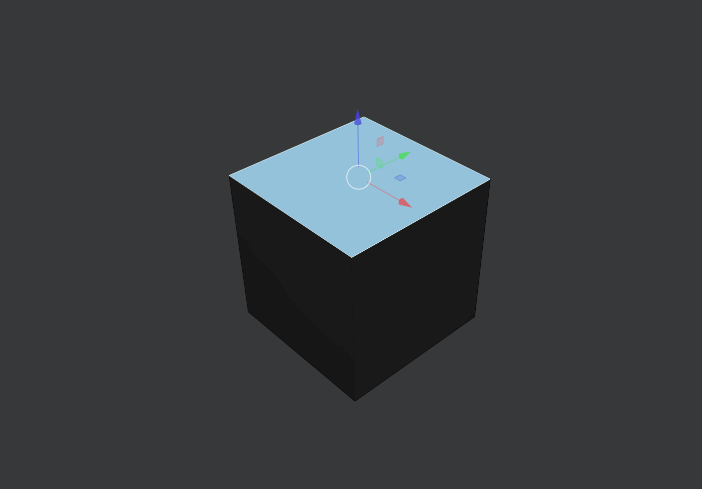

##Transform

###Transform Mode Cycle
Cycles between the different transform modes (move, rotate and scale). 

Its possible to make it deactivate the transform gizmos after Scale in the [**preferences**](../Preferences) 

###CS Move

If the current transform mode is not Move it will activate the Move gizmo

If the current transform gizmo is Move it will activate the Move tool.	

###CS Rotate

If the current transform mode is not Rotate it will activate the Rotate gizmo

If the current transform gizmo is Rotate it will activate the Rotate tool.	

###CS Scale

If the current transform mode is not Scale it will activate the Scale gizmo

If the current transform gizmo is Scale it will activate the Scale tool.	
